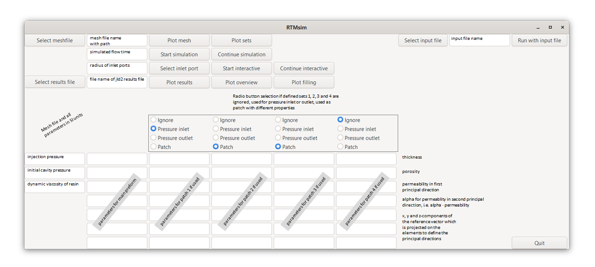

# RTMsim - A Julia module for filling simulations in Resin Transfer Moulding


## Mould filling simulations in Resin Transfer Moulding
Resin Transfer Moulding (RTM) is a manufacturing process for producing thin-walled fiber reinforced polymer composites where dry fibers are placed inside a mould and resin is injected under pressure into the fibrous preform. During mould design, filling simulations can study different manufacturing concepts (i.e. placement of inlet ports and vents) to guarantee complete filling of the part and avoid air entrapment where flow fronts converge. 

RTMsim is a new software tool for RTM filling simulations. The porous cavity is fully described by a mesh file with triangular cells on the part’s mid-surface and cell set definitions. The latter can be used for specifying the location of the pressure injection ports and regions with different preforms by assigning different thickness, porosity and permeability values. Additional equations (e.g. for modeling the degree-of-cure) can either be added with equations of the same type or modifications of existing equations (e.g. for variable cavity thickness as needed for vacuum assisted resin infusion simulations). Several test cases were used for successfully validating the implemented model.


## How to get

### Requirments and installing Julia
The RTMsim module was developed with Julia version >= 1.8. Julia is a high level open source programming language and it is as easy to use as python or Matlab. 

First of all you need a Julia installation.  Download Julia from https://julialang.org/downloads/. Install Julia and add an environment variable such that the Julia terminal can be started from the command line.


### Installing using the Julia Package manager
Open a Julia terminal. The only thing you have to do is to add the package to your Julia environment with the following commands:
- `using Pkg`
- `Pkg.add(url="https://github.com/obertscheiderfhwn/RTMsim")` or `Pkg.add(url="https://github.com/obertscheiderfhwn/RTMsim",rev="1.0.4")` for specific revision `1.0.4`
- `Pkg.test("rtmsim")`
Alternatively, one can use the package manager with the following commands:
- Change to package manager with `]` 
- `add "https://github.com/obertscheiderfhwn/RTMsim"`
- Return with the `backspace` key


## How to use
For testing the software create a directory and download mesh- and input-files:
- Create a working directory
- Figure out the location of the package with `using rtmsim` and afterwards `pathof(rtmsim)`
- Copy from the package location the folder with the `meshfiles` and the `inputfiles` into the working directory

Start the GUI in the Julia terminal:
- In the Julia terminal `cd("my\\workdirectory")` where the separation is a `\\`
- `using rtmsim
- Start the GUI with `rtmsim.gui()`

If you are working on a Windows operating system you can avoid working in the Julia terminal: 
- Copy `start_rtmsim_gui.bat` and `start_rtmsim_gui.jl` from the package folder to the working directory
- Double click on `start_rtmsim_gui.bat` in the Explorer

You can start a simulation in the GUI:
- The buttons in the first line on the LHS are used for mesh inspection, i.e. select a mesh file, plot the mesh with bounding box and plot the defined sets. The buttons in the second line on the LHS are used for starting and continuing a filling simulation. Every time the Start or Continue simulation button is pressed, a filling simulation is started. The simulated flow time `tmax`, the patch types and patch properties must be specified before. Every simulation calculates the flow front propagation during the next `tmax` seconds. If started with the Start simulation button, the cavity is empty initially. If started with the Continue simulation button, the results from the previous simulation are taken as initial condition. With the buttons in the third line one can select inlet ports with specified radius interactively in addition to using the defined sets, and start and continue such a simulation. The buttons in the forth line are used for post-processing, i.e. show filling and pressure distribution of a specified output file (final results are saved in results.jld2), plot filling at four equidistant time instances and filling at different time instances which are selected with a slider bar. The buttons in the line on the RHS are used to start the simulation with the parameters from the selected input file.
<br><br>
- Additional information (for example the meaning of the parameters) can be found on https://obertscheiderfhwn.github.io/RTMsim/build/functions/ and tutorials (with typical use cases) can be found on https://obertscheiderfhwn.github.io/RTMsim/build/tutorials/ for the meaning of the parameters and for typical use cases.


## How to support and contribute
Suggestions for functionalities to be implemented and user feedback from case studies with this software are appreciated. Please have a look at the contribution item in the community standards https://github.com/obertscheiderfhwn/RTMsim/community.

The API is described on  https://obertscheiderfhwn.github.io/RTMsim/build/functions/.


## Citation
If RTMsim is used for research or development, please use the following entry, shown in BiBTeX format:
```
@misc{RTMsim,
  author =       {Obertscheider, Christof and Fauster, Ewald},
  title =        {RTMsim - A Julia module for filling simulations in Resin Transfer Moulding},
  howpublished = {\url{https://github.com/obertscheiderfhwn/RTMsim}},
  year =         {2022}
}
```
