# RTMsim - A Julia module for filling simulations in Resin Transfer Moulding


# Statement of need
Resin Transfer Moulding (RTM) is a manufacturing process for producing thin-walled fiber reinforced polymer composites where dry fibers are placed inside a mould and resin is injected under pressure into the fibrous preform. During mould design, filling simulations can study different manufacturing concepts (i.e. placement of inlet ports and vents) to guarantee complete filling of the part and avoid air entrapment where flow fronts converge. 

In the past, numerous models have been implemented in different software packages to perform filling simulations for RTM. The used simulation packages can be divided into three groups: 
- General purpose CFD software packages, such as ANSYS Fluent or OpenFOAM
- Commercially available software packages which are tailored for the simulation of the RTM process, such as PAM-RTM, RTM-Worx or LIMS
- Easy-to-use simulation tools such as myRTM

All packages describe the flow on a macroscopic level. The first group models the flow through the porous cavity using volume-averaged Navier-Stokes equations. The second group makes use of some assumptions and solves in a first step a Laplace equation for the pressure inside the region which is already filled and in a second step calculates the flow velocity field to propagate the flow front. It has been shown that the first and second group render very similar results. myRTM from the third group is easy-to-use and can predict the filling pattern properly but neither predict the filling time correctly nor consider orthotropic preform permeability. Solving conservation laws for fluid flow as in the first group requires a volume mesh of the cavity and consequently the solution is more time-consuming. The second and third group can be solved on a shell mesh where the thickness of the cavity is a property of the cell (similar to porosity and permeability) and slip boundary conditions at the top and bottom walls of the cavity are assumed. 

Based on the analysis of the existing software tools for RTM filling simulations the following functional requirements for a new software tool were derived:
- The simulation model shall give correct results for filling pattern and filling time.
- The simulation tool takes only composite-manufacturing related inputs and the simulation shall be robust independent of numerics-related input.
- The simulation tool takes a shell model of the geometry as input and the location-dependent properties are assigned directly on the shell elements.
- New functionalities can be implemented by either adding equations of the same type or modifying existing equations.

RTMsim ia a new software tool for RTM filling simulations which fulfills these requirements: Several test cases were used for successfully validating the implemented model. The simulation shall run robustly and independent of numericsrelated input. The porous cavity is fully described by a mesh file with triangular cells on the part’s mid-surface and cell set definitions (for specifying the location of the pressure injection ports and regions with different preforms by assigning different thickness, porosity and permeability values). Additional equations (e.g. for modeling the degree-of-cure) can either be added with equations of the same type or modifications of existing equations (e.g. for variable cavity thickness as needed for vacuum assisted resin infusion simulations). 

# Installation instructions

In order to use RTMsim for filling simulations, download Julia from https://julialang.org/downloads/ and add Julia to path such that can be started from command line, open Julia terminal, change to package manager with `]` and `add Gtk GLMakie Makie NativeFileDialog Glob LinearAlgebra JLD2 GeometryBasics Random FileIO ProgressMeter`. For Windows operating system: Go to the directory with the RTMsim repository and double click on run_rtmsim_GUI.bat to start the GUI. For all operating systems: One has access to all functions through the Julia terminal. Open a Julia terminal, change to the directory with the RTMsim repository with `cd("path\\to\\working\\directory")` where the path can be absolute or relative and the levels are separated by `\\` and then start either the GUI with `include("rtmsim_GUI.jl")` or call all functions directly after executing `include("rtmsim.jl")`. Popular functions are:
- `rtmsim.plot_mesh(1,"meshfiles\\mesh_permeameter1_foursets.bdf")` for plotting the mesh defined in the bdf-file
- `rtmsim.plot_sets("meshfiles\\mesh_permeameter1_foursets.bdf")` for plotting the sets specified in the bdf-file
- `rtmsim.rtmsim_rev1(1,"meshfiles\\mesh_permeameter1_foursets.bdf",200, 101325,1.225,1.4,0.06, 1.35e5,1.00e5, 3e-3,0.7,3e-10,1,1,0,0, 3e-3,0.7,3e-10,1,1,0,0, 3e-3,0.7,3e-11,1,1,0,0, 3e-3,0.7,3e-11,1,1,0,0, 3e-3,0.7,3e-9,1,1,0,0, 1,2,2,2,0,"results.jld2",0,0.01,16)` for starting a simulation with different patches and race tracking
- `rtmsim.rtmsim_rev1(1,"meshfiles\\mesh_permeameter1_foursets.bdf",200, 101325,1.225,1.4,0.06, 1.35e5,1.00e5, 3e-3,0.7,3e-10,1,1,0,0, 3e-3,0.7,3e-10,1,1,0,0, 3e-3,0.7,3e-11,1,1,0,0, 3e-3,0.7,3e-11,1,1,0,0, 3e-3,0.7,3e-9,1,1,0,0, 1,2,2,3,0,"results.jld2",1,0.01,16)` for continuing the previous simulation
- `rtmsim.plot_mesh("meshfiles\\mesh_annulusfiller1.bdf",2)` for the manual selection of inlet ports with left mouse button click while key `p` is pressed
- `rtmsim.rtmsim_rev1(1,"meshfiles\\mesh_annulusfiller1.bdf",200, 0.35e5,1.205,1.4,0.06, 0.35e5,0.00e5, 3e-3,0.7,3e-10,1,1,0,0, 3e-3,0.7,3e-10,1,1,0,0, 3e-3,0.7,3e-10,1,1,0,0, 3e-3,0.7,3e-10,1,1,0,0, 3e-3,0.7,3e-10,1,1,0,0, 0,0,0,0, 0,"results.jld2",1,0.01,16)` for starting only with the interactively selected inlet ports
- `rtmsim.plot_results("results.jld2")` for plotting the final filling and pressure contours
- `rtmsim.plot_overview(-1,-1)` for plotting the filling contours at four equidistant time instances
- `rtmsim.plot_filling(-1,-1)` for plotting the filling at different time instances selected with a slider bar
- `rtmsim.start_rtmsim("input.txt")` for starting a simulation with the parameters specified in the text file input.txt

# Example usage

## Mesh preparation

The new simulation tool does not include mesh generation. A mesh with the pre-defined regions must be generated with a meshing tool before starting the filling simulation. The authors used Altair HyperWorks but also free software tools like SALOMEMECA, GMSH or NETGEN can be used.

The shell mesh is created on the part's mid-surface. Mid-surface models are often available in composite manufacturing since computational stress analysis for thin-walled parts is performed on the part’s mid-surface too. 

The prepared shell mesh is imported via a text file where nodes, elements and element sets are described in a format similar to the NASTRAN bulk data format. Every line contains ten fields of eight characters each. The first field contains the character name of the item. The input file for the permeameter reads:
```
SET 1 = 1,2,3,4,5,6,
7,8,9,10,11,12,
13,14,15,16
GRID 1 0.0 0.0 0.0
GRID 3 0.3 0.3 0.0
GRID 4 -0.3 0.3 0.0
[...]
GRID 331 -2.115-2-.113318 0.0
GRID 332 -.117148.1562872 0.0
GRID 333 .2271322.1925105 0.0
CTRIA3 1 0 15 9 16
CTRIA3 2 0 16 10 19
CTRIA3 3 0 19 11 17
[...]
CTRIA3 586 0 243 302 332
CTRIA3 587 0 262 333 259
CTRIA3 588 0 232 259 333
```
Nodes are described by the keyword `GRID`, followed by a grid number, followed by a blank and three fileds with the x, y and z coordinates of the node. The triangular cells are defined by the keyword `CTRIA3`, followed by a cell number, followed by a zero, followed by the three node numbers which constitute the cell. Nodes and elements need not be sorted nor starting with one. Cell sets are defined by the keyword `SET` followed by ` N = ` and the cell numbers separated by commas. Not more than 6 cell numbers per line. If another line is required for additional cell numbers, these follow after 8 blanks. Up to four sets can be defined. 

## Run a simulation

RTMsim is executed with a well-defined list of parameters specified in an input text file, in the GUI or in the function call `rtmsim.rtmsim_rev1` in the terminal. The following figure shows the GUI with explaination for the parameters. 


The buttons in the first line on the LHS are used for mesh inspection, i.e. select a mesh file, plot the mesh with bounding box and plot the defined sets. The buttons in the second line on the LHS are used to start and continue the simulation. The maximum simulation time and the type and properties of the defined sets must be set before. With the buttons in the third line one can select inlet ports with specified radius interactively in addition to using the defined sets, and start and continue such a simulation. The buttons in the forth line are used for post-processing, i.e. show filling and pressure distribution of a specified output file (final results are saved in results.jld2), plot filling at four equidistant time instances and filling at different time instances which are selected with a slider bar. The buttons in the line on the RHS are used to start the simulation with the parameters from the selected text input file.

The complete set of input parameters can be accessed in the text input file. The text input file `input_case1_coarsemesh.txt` for case 1 with the coarse mesh is:
```
1    #i_model 
meshfiles\\mesh_permeameter1_foursets.bdf    #meshfilename 
200    #tmax 
1.01325e5 1.225 1.4 0.06    #p_ref rho_ref gamma mu_resin_val 
1.35e5 1.0e5    #p_a_val p_init_val 
3e-3 0.7 3e-10 1 1 0 0    #t_val porosity_val K_val alpha_val refdir1_val refdir2_val refdir3_val 
3e-3 0.7 3e-10 1 1 0 0    #t1_val porosity1_val K1_val alpha1_val refdir11_val refdir21_val refdir31_val 
3e-3 0.7 3e-10 1 1 0 0    #t2_val porosity2_val K2_val alpha2_val refdir12_val refdir22_val refdir32_val
3e-3 0.7 3e-10 1 1 0 0    #t3_val porosity3_val K3_val alpha3_val refdir13_val refdir23_val refdir33_val
3e-3 0.7 3e-10 1 1 0 0    #t4_val porosity4_val K4_val alpha4_val refdir14_val refdir24_val refdir34_val 
1 0 0 0    #patchtype1val patchtype2val patchtype3val patchtype4val 
0 results.jld2    #i_restart restartfilename
0 0.01    #i_interactive r_p
16    #n_pics
```

Parameter `i_model` specifies the flow model (`=1` for iso-thermal RTM). `meshfilename` specified the relative or absolute path to the used mesh file. `tmax` defines the simulated filling time. The parameters in the forth line define the adiabatic equation of state (reference pressure, reference density, adiabatic index) for air and the dynamic viscosity of the resin. The parameters in the fifth line define injection pressure and initial cavity pressure. The parameters in the lines 6 to 10 specify the preform parameters for the main preform and the optional four sets with different preform parameters. The preform parameters of the four optional sets are only used if the corresponding patch type in line 11 is set equal to 2. If equal to 0, the patch is ignored and part of the main preform. If equal to 1, the patch is a pressure inlet with injection pressure. If equal to 3, the patch is a pressure outlet with initial cavity pressure. The sets for the patches are defined in the mesh file in ascending order. If less than four are defined, patch types cannot be assigned. The preform parameters are preform thickness, porosity, permeability in first principal cell direction, permeablitiy fraction alpha specifies the permeablity in the second principal cell direction as alpha times permeablity in the first principal direction and the three components of a reference vector which is projected onto the cells to define the first principal cell direction. The parameters in line 12 are used for continuing a simulation, if `i_restart=1` with the data saved in file `restartfilename`. In line 13 the interactive mode can be turned on if `i_interactive=1`. At selected points in the preform (plot the mesh with second parameter `=2` and select with `p`+LMB), additional inlet port with radius `r_p` are assigned. If all patch types are `=0`, only the selected inlet ports are used. Otherwise the settings are cummulative. The last parameter `n_pics` determines the number of intermediate outputs.

The validation and verification cases can be executed by selecting the appropriate input file and afterwards running the simulation with this input file. The input files for the four validation cases are `input_case1_coarsemesh.txt`, `input_case1_finemesh.txt`, `input_case2_coarsemesh.txt`, `input_case2_finemesh.txt`, `input_case3_coarsemesh.txt`, `input_case3_finemesh.txt, input_case4.txt` or from the Julia terminal with `rtmsim.start_rtmsim("inputfiles\\input_case1_coarsemesh.txt")` with the different input file name as argument. The input file names are saved in directory `inputfiles`. The filling overview is created with the button `Plot overview` or with `rtmsim.plot_overview(-1,-1)`. 


# Validation and verification examples

Three different test cases are available, successfully validating the Julia implementation of the RTM filling model:
1. Validation of the software tool for radial flow with isotropic in-plane peremablity: The simulated flow front position after 200 s is compared with the calculated flow front postion from literature.  
2. Verification of the software tool for radial flow with tilted orthotropic in-plane permeablity: The simulated tilted elliptical flow front is analysed and the calculated orthotropic permeablity is compared with the simulation input.
3. Comparison of the simulated flow front position for a complex annulus filler-like part with the simulated flow front position from Ansys Fluent and comparison of the simulated filling pattern with results from a myRTM simulation.

The following passages show and explain the simulation results (after rotating the views with LMB) for the test cases.

Results for coarse and fine mesh of case 1:
<br>
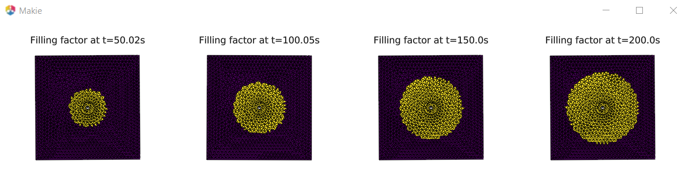<br>
According to an analytical estimation, the flow front after 50, 100, 150 and 200 s is a circle with radius 0.114, 0.150, 0.178 and 0.200 mm. The values for the fine mesh agree well with the results from the analytical formula. The values for the coarse mesh show an error of <15% which decreases significantly in the course of time but the shape is no smooth circle.

Results for coarse and fine mesh of case 2:
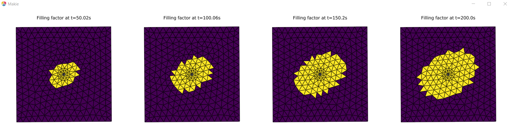<br>
<br>
Simulation input is porosity 0.70, permeability 3.0e-10 m^2 in first principal direction 30° to the horizontal and permeability 1.5e-10 m^2 in second principal direction. Analyzing the flow front after 200 s, the orthotropic permeability is described by 2.91e-10 m^2, 1.41e-10 m^2 and angle 30° for the fine mesh and 2.43e-10 m^2, 1.17e-10 m^2 and 29° for the coarse mesh. For the fine mesh (2198 cells for a domain with 600 × 600 mm), this reverse engineering shows very good agreement of the calculated orthotropic permeability  with the values used as simulation input. For the coarse mesh (588 cells) the agreement is still acceptable.

Results for coarse and fine mesh of case 3:
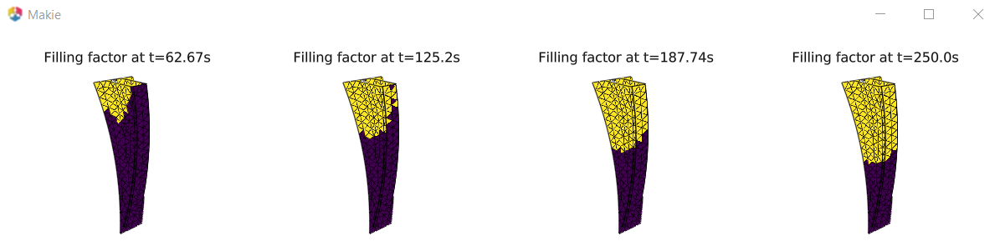<br>
<br>
If the position of inlet and outlet ports is investigated, simulations with a coarse mesh and short simulation time is sufficient since the flow front progagation is predicted properly. The acutal filling time can be predicted with a fine mesh. A mesh refinement study must be performed. With the coarse mesh it takes approximately 50 s longer to reach the same filling state.

# Examples of usage

The following three examples show typical use cases how RTMsim is used by engineers:

1. This examples shows how to start a simulation with the GUI. First, inspect the mesh file and plot the pre-defined sets:<br>
<br>
Select the mesh file `meshfiles\\mesh_permeameter1_foursets.bdf` and set all other parameters as shown:<br>
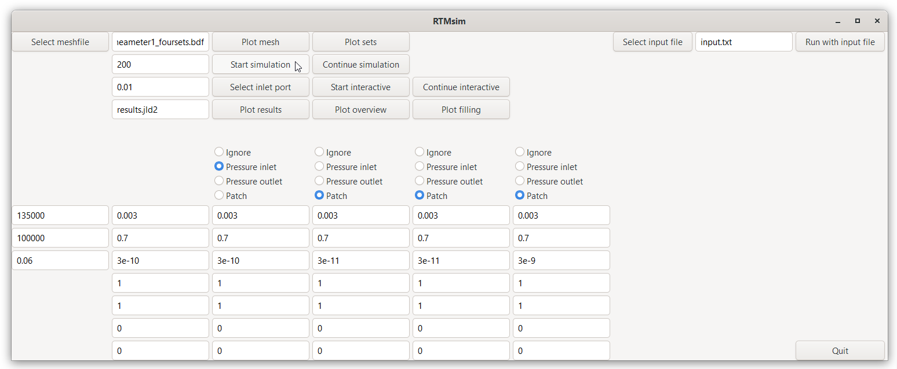<br>
Set 1 is the pressure inlet, set 2 and set 3 are reinforcement patches with lower permeability and set 4 is a racetracking channel between the main preform and set 3 with same porosity but a factor 10 higher permeability than the main preform (racetracking with higher permeablity=higher flow speed takes place in thin regions between different patches or at the preform boundary). Start the simulation and plot the filling overview after 200 s simulation time:<br>
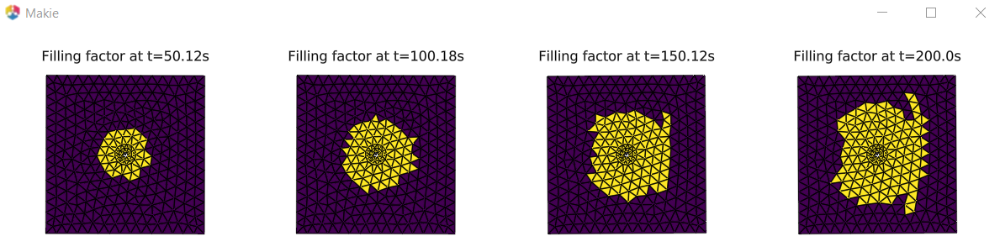<br>
Continue the simulation for another 100 s simulation time and plot the filling overview:<br>
<br>

2. This example shows how to use outlet ports and how to customize the code. If outlet ports are defined, the outlet ports are connected to the catch pot (typically at ambient pressure or evacuated). If no outlet ports are defined, these hoses are clamped. If wiggles (oscillations) are present in the pressure contour plot, a gradient limiter is used in the function `numerical_gradient`. The function is called with i_method=2 as first argument: 
`dpdx,dpdy=numerical_gradient(2,ind,p_old,cellneighboursarray,cellcentertocellcenterx,cellcentertocellcentery);` <br>
After modifying and compiling the code and starting the GUI, the simulation is started with the following settings:<br>
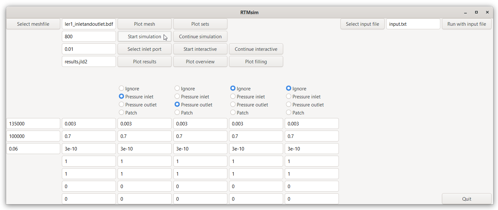<br>
The results plot shows the completely filled part with the grey inlet and outlet ports and the pressure contour with the wiggles:<br>
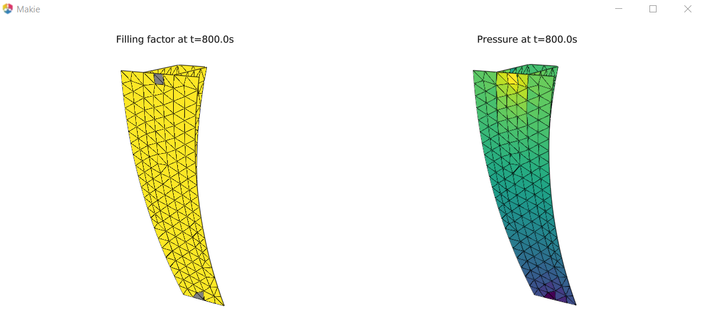<br>
The filling overview is:<br>
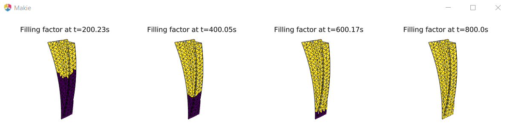<br>
The filling overview without pressure shows only slighly differences at the very end of the filling:<br>
<br>


3. This example shows a workflow for selecting the inlet ports interactively. First, select the mesh file `meshfiles\\mesh_annulusfiller1.bdf` and plot the mesh to see the bounding box size of the part:<br>
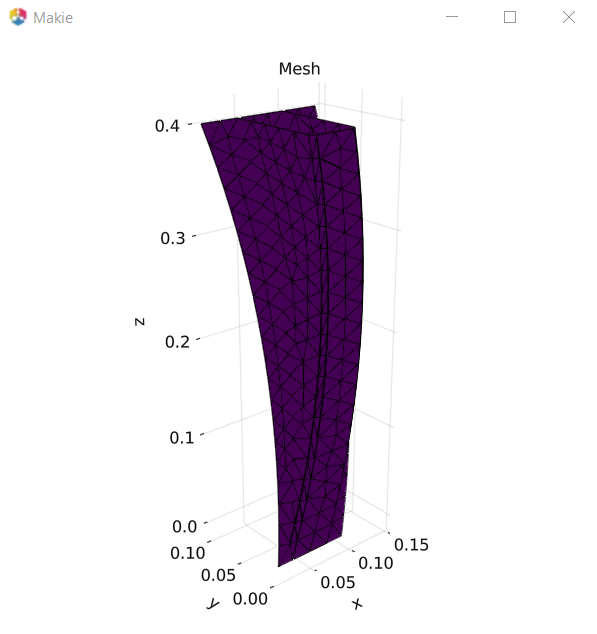<br>
Specify the inlet port radius and press the Select inlet port button:<br>
<br>
Rotate the view with the nodes with LMB and select an inlet port location with key `p`+LMB. After selection the node is highlighted:<br>
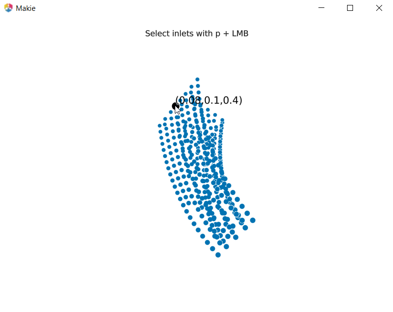<br>
Selection of multiple nodes is possible. Then close the graphics window and start the simulation with the settings shown above by clicking the Start interactive button. All radio buttons show ignore if only the interactively selected inlet is used. In general, sets defining different preform properties or additional inlet ports or outlet regions can also be used in interactive mode. Plot the filling overview:<br>
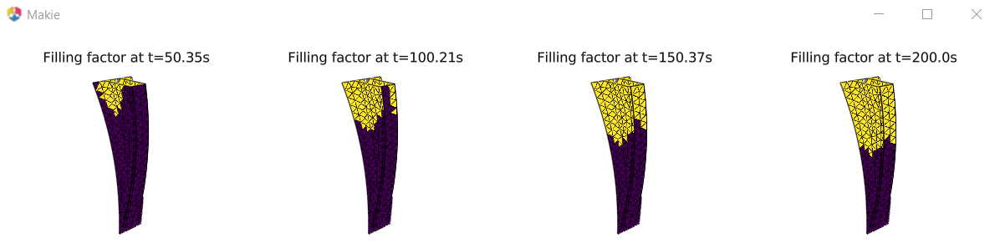<br>
If cascade injection is planned (additional inlet port which is activated just befor the flow front reaches this location), select two inlet ports after clicking the button Select inlet port. The first one at the same location as before and the second one at the end of the current position of the flow front. Close the graphics window and continue the simulation with the button Continue interactive.<br>
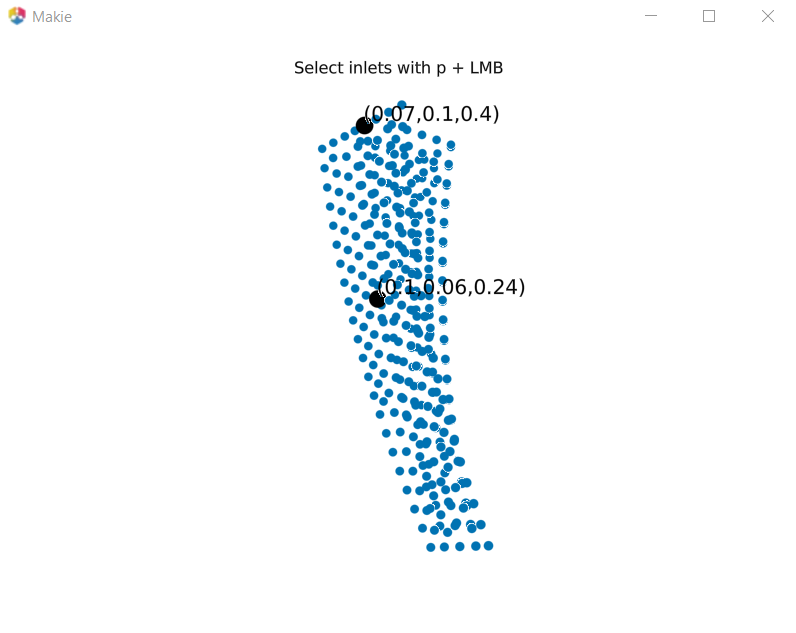<br>
The filling and the final pressure contour are:<br>
<br>
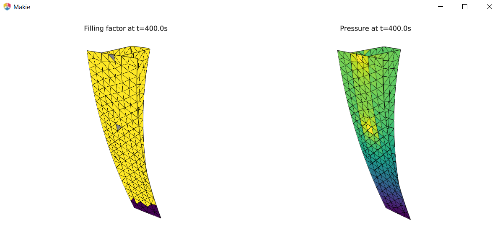<br>
The filling without cascade injection after 400 s is much slower: <br>
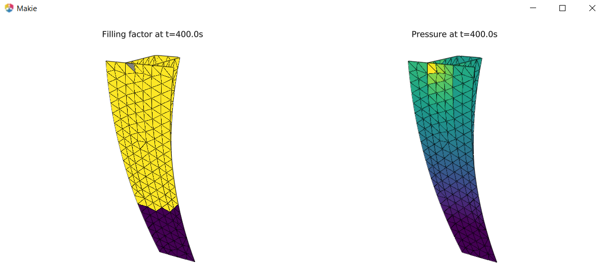<br>


# Future work

The source code is prepared for the following extensions:
- Import mesh file in different format. Selection is based on the extension of the mesh file.
- Input parameter `i_model` (for iso-thermal RTM `=1`) is used for adding additional functionalities. E.g. adding temperature and degree-of-cure equations with variable resin viscosity ar for VARI with variable porosity and permeability.
- Parameter `i_method` in the functions for numerical differentiation and flux functions can be used to implement different numerical schemes. E.g. gradient limiter or second-order upwinding.

E.g. a numerical gradient calculation with gradient limiter is used if the function `numerical_gradient` is called with i_method=2 as first argument: 
`dpdx,dpdy=numerical_gradient(2,ind,p_old,cellneighboursarray,cellcentertocellcenterx,cellcentertocellcentery);` <br>
In the function a case selection determines the used method:
```
function numerical_gradient(i_method,ind,p_old,cellneighboursarray,cellcentertocellcenterx,cellcentertocellcentery);
        if i_method==1;
            #least square solution to determine gradient
            cellneighboursline=cellneighboursarray[ind,:];
            cellneighboursline=cellneighboursline[cellneighboursline .> 0]
            len_cellneighboursline=length(cellneighboursline)
            bvec=Vector{Float64}(undef,len_cellneighboursline);
            Amat=Array{Float64}(undef,len_cellneighboursline,2);  
            for i_neighbour in 1:len_cellneighboursline;
                i_P=ind;
                i_A=cellneighboursarray[ind,i_neighbour];  
                Amat[i_neighbour,1]=cellcentertocellcenterx[ind,i_neighbour]
                Amat[i_neighbour,2]=cellcentertocellcentery[ind,i_neighbour]
                bvec[i_neighbour]=p_old[i_A]-p_old[i_P];
            end
            xvec=Amat[1:len_cellneighboursline,:]\bvec[1:len_cellneighboursline];
            dpdx=xvec[1];
            dpdy=xvec[2];
        elseif i_method==2;
            #least square solution to determine gradient with limiter
            cellneighboursline=cellneighboursarray[ind,:];
            cellneighboursline=cellneighboursline[cellneighboursline .> 0]
            len_cellneighboursline=length(cellneighboursline)
            bvec=Vector{Float64}(undef,len_cellneighboursline);
            Amat=Array{Float64}(undef,len_cellneighboursline,2);  
            wi=Vector{Float64}(undef,len_cellneighboursline);
            for i_neighbour in 1:len_cellneighboursline;
                i_P=ind;
                i_A=cellneighboursarray[ind,i_neighbour];  
                exp_limiter=2;
                wi[i_neighbour]=1/(sqrt((cellcentertocellcenterx[ind,i_neighbour])^2+(cellcentertocellcentery[ind,i_neighbour])^2))^exp_limiter;
                Amat[i_neighbour,1]=wi[i_neighbour]*cellcentertocellcenterx[ind,i_neighbour]
                Amat[i_neighbour,2]=wi[i_neighbour]*cellcentertocellcentery[ind,i_neighbour]
                bvec[i_neighbour]=wi[i_neighbour]*(p_old[i_A]-p_old[i_P]);
            end
            xvec=Amat[1:len_cellneighboursline,:]\bvec[1:len_cellneighboursline];
            dpdx=xvec[1];
            dpdy=xvec[2];
        end
        return dpdx,dpdy
    end
    ```

After modifying and compiling the RTMsim module, a simulation can be started with the GUI or with the terminal.
