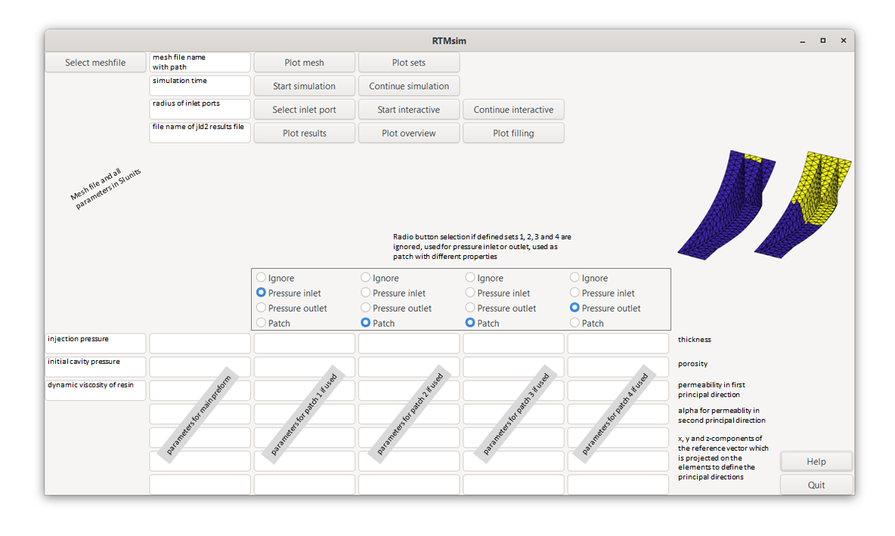

# RTMsim - Filling simulations in Resin Transfer Moulding with the Finite Area Method
Christof Obertscheider, Aerospace Engineering Department, University of Applied Sciences Wiener Neustadt, Johannes-Gutenberg-Straße 3, 2700, Wiener Neustadt, Austria <br>
Ewald Fauster, Processing of Composites Group, Department Polymer Engineering and Science, Montanuniversität Leoben, Otto Glöckl-Straße 2, 8700 Leoben, Austria 

## Summary
Resin Transfer Moulding (RTM) is a manufacturing process forproducing thin-walled fiber reinforced polymer composites where dry fibers are placed inside a mould and
resin is injected under pressure into the fibrous preform. RTMsim is a robust, easy-to-use and simple-to-extend software tool, written in Julia, for RTM filling simulations. A shell mesh, injection pressure, resin viscosity and the parameters describing the preform are required input. The software was validated with results from literature as well as experiments and compared with results from well-established RTM filling simulation tools.

## Statement of need
Resin Transfer Moulding (RTM) is a manufacturing process for producing thin-walled fiber reinforced polymer composites where dry fibers are placed inside a mould and resin is injected under pressure into the fibrous preform. During mould design, filling simulations can study different manufacturing concepts (i.e. placement of inlet ports and vents) to guarantee complete filling of the part and avoid air entrapment where flow fronts converge. 

In the past, numerous models have been implemented in different software packages to perform filling simulations for RTM. The used simulation packages can be divided into three groups: 
- General purpose CFD software packages, such as ANSYS Fluent or OpenFOAM
- Commercially available software packages which are tailored for the simulation of the RTM process, such as PAM-RTM, RTM-Worx or LIMS
- Easy-to-use simulation tools such as myRTM

All packages describe the flow on a macroscopic level. The first group models the flow through the porous cavity using volume-averaged Navier-Stokes equations. The second group makes use of some assumptions and solves in a first step a Laplace equation for the pressure inside the region which is already filled and in a second step calculates the flow velocity field to propagate the flow front. It has been shown that the first and second group render very similar results. myRTM from the third group is easy-to-use and can predict the filling pattern properly but neither predict the filling time correctly nor consider orthotropic preform permeability. Solving conservation laws for fluid flow as in the first group requires a volume mesh of the cavity and consequently the solution is more time-consuming. The second and third group can be solved on a shell mesh where the thickness of the cavity is a property of the cell (similar to porosity and permeability) and slip boundary conditions at the top and bottom walls of the cavity are assumed. 

Based on the analysis of the existing software tools for RTM filling simulations the following functional requirements for a new software tool were derived:
- The simulation model shall give correct results for filling pattern and filling time.
- The simulation tool takes only composite-manufacturing related inputs and the simulation shall be robust independent of numerics-related input.
- The simulation tool takes a shell model of the geometry as input and the location-dependent properties are assigned directly on the shell elements.
- New functionalities can be implemented by either adding equations of the same type or modifying existing equations.

RTMsim ia a new software tool for RTM filling simulations which fulfills these requirements: Several test cases were used for successfully validating the implemented model. The simulation shall run robustly and independent of numericsrelated input. The porous cavity is fully described by a mesh file with triangular cells on the part’s mid-surface and cell set definitions (for specifying the location of the pressure injection ports and regions with different preforms by assigning different thickness, porosity and permeability values). Additional equations (e.g. for modeling the degree-of-cure) can either be added with equations of the same type or modifications of existing equations (e.g. for variable cavity thickness as needed for vacuum assisted resin infusion simulations). 

## Physical model and discretization

From a flow physics point of view the filling process is described by an incompressible resin which is injected under pressure into a cavity which initially
is either evacuated or filled with air. Since the simulation tool shall run robust and independent of numerics-related input like under-relaxation coefficients or time-steps, a one phase compressible model is chosen. Conservation laws for a compressible continuity equation, momentum equations in a local cell coordinate system (to consider the orthotropic permeability), an adiabatic law as equation of state and a volume-of-fluid equation to track the resin flow front must be solved. All partial differential equations can be solved using the same method. Other conservation laws, e.g. temperature or degree-of-cure equations to include non-constant resin viscosity, can be added with a similar method. Modifications of the existing conservation laws, e.g. introducing a thickness-dependent permeability which is needed for modeling vacuum-assisted resin infusion (VARI), can be implemented by changing the existing discretized equations.

In order to numerically solve the flow model the computational domain (time and space) is discretized. The temporal domain (i.e. the simulation time) is split into a finite number of time steps where values for the physical quantities on the spatial domain are calculated in a time-marching manner. The spatial domain (i.e. the flow volume) is split into wedge-type cells. Since the walls are assumed to be slip boundaries only one cell is used through the thickness and the cells are bounded by three control surfaces only. Therefore, the spatial domain is defined on the part’s mid-surface and the local thickness of the flow volume is a property of the cell. The mid-surface model can be curved and cells can have edges where more than two cells are connected to each other such as for handling T-junctions. The mid-surface model is divided into a finite number of triangular control areas. The control areas cover the spatial domain completely without overlapping. The cell-centered method where the nodes are placed at the centroid of the control volume is used. 

For discretizing the equations on the shell mesh of the part’s mid-surface it is assumed that the geometry was locally flat there. The neighbouring cells are
rotated about the common edges to lie in the plane of the considered cell. Well established methods from CFD were used for the Finite-volume discretization.

The new simulation tool does not include mesh generation. A mesh with the pre-defined regions must be generated with a meshing tool before starting the
filling simulation. Creating a shell mesh is easier than creating a volume mesh and the number of cells and the computational time can be reduced significantly
compared to a volume mesh which has to fulfill cell quality requirements (e.g. for skewness and orthogonality). Shell meshes are typically created on the part’s
mid-surface. Mid-surface models are often available in composite manufacturing since computational stress analysis for thin-walled parts is performed on the part’s mid-surface too. Since a shell mesh is used in the simulation tool, the conservation laws must be solved on a shell mesh using a generalization of the
so-called finite area method. 

## Mesh preparation

The prepared shell mesh is imported via a text file where nodes, elements and element sets are described in a format similar to the NASTRAN bulk data format. Every line contains ten fields of eight characters each. The first field contains the character name of the item. The input file for the permeameter reads:
```
SET 1 = 1,2,3,4,5,6,
7,8,9,10,11,12,
13,14,15,16
GRID 1 0.0 0.0 0.0
GRID 3 0.3 0.3 0.0
GRID 4 -0.3 0.3 0.0
[...]
GRID 331 -2.115-2-.113318 0.0
GRID 332 -.117148.1562872 0.0
GRID 333 .2271322.1925105 0.0
CTRIA3 1 0 15 9 16
CTRIA3 2 0 16 10 19
CTRIA3 3 0 19 11 17
[...]
CTRIA3 586 0 243 302 332
CTRIA3 587 0 262 333 259
CTRIA3 588 0 232 259 333
```
Nodes are described by the keyword `GRID`, followed by a grid number, followed by a blank and three fileds with the x, y and z coordinates of the node. The triangular cells are defined by the keyword `CTRIA3`, followed by a cell number, followed by a zero, followed by the three node numbers which constitute the cell. Nodes and elements need not be sorted nor starting with one. Cell sets are defined by the keyword `SET` followed by ` N = ` and the cell numbers separated by commas. Not more than 6 cell numbers per line. If another line is required for additional cell numbers, these follow after 8 blanks. Up to four sets can be defined. Mesh files of this type can be created with common meshing tools. The authors used Altair HyperWorks but also free software tools like SALOMEMECA, GMSH or NETGEN can be used.

# Input parameters

RTMsim is executed with a well-defined list of parameters specified in an input text file or in the GUI. The following figure shows the GUI with explaination for the parameters. 



The complete set of input parameters can be addressed in the text file `input.txt`:
```
1    #i_model 
meshfiles\\mesh_permeameter1_foursets.bdf    #meshfilename 
200    #tmax 
1.01325e5 1.225 1.4 0.06    #p_ref rho_ref gamma mu_resin_val 
1.35e5 1.0e5    #p_a_val p_init_val 
3e-3 0.7 3e-10 1 1 0 0    #t_val porosity_val K_val alpha_val refdir1_val refdir2_val refdir3_val 
3e-3 0.7 3e-10 1 1 0 0    #t1_val porosity1_val K1_val alpha1_val refdir11_val refdir21_val refdir31_val 
3e-3 0.7 3e-10 1 1 0 0    #t2_val porosity2_val K2_val alpha2_val refdir12_val refdir22_val refdir32_val
3e-3 0.7 3e-10 1 1 0 0    #t3_val porosity3_val K3_val alpha3_val refdir13_val refdir23_val refdir33_val
3e-3 0.7 3e-10 1 1 0 0    #t4_val porosity4_val K4_val alpha4_val refdir14_val refdir24_val refdir34_val 
1 0 0 0    #patchtype1val patchtype2val patchtype3val patchtype4val 
0 results.jld2    #i_restart restartfilename
0 0.01    #i_interactive r_p
16    #n_pics
```


# Run simulation

In order to use RTMsim follow the following steps:
- Download Julia from https://julialang.org/downloads/ and add Julia to path such that can be started from command line.
- Open Julia terminal, change to package manager with `]` and `add Gtk GLMakie Makie NativeFileDialog Glob LinearAlgebra JLD2 GeometryBasics Random FileIO ProgressMeter`.
- Go to the directory with the RTMsim repository and double click on run_rtmsim_GUI.bat for GUI or run_rtmsim.bat for use of input.txt. 

Alternatively, open Julia terminal, go to the directory with the RTMsim repository with `cd("path")` and start with `include("rtmsim_GUI.jl")` or `include("rtmsim.jl")`. There one has direct access to all functions, e.g. 
- `rtmsim.plot_mesh(1,"meshfiles\\mesh_permeameter1_foursets.bdf")` for plotting the mesh
- `rtmsim.plot_sets("meshfiles\\mesh_permeameter1_foursets.bdf")` for plotting the sets specified in the mesh file
- `rtmsim.rtmsim_rev1(1,"meshfiles\\mesh_permeameter1_foursets.bdf",200, 101325,1.225,1.4,0.06, 1.35e5,1.00e5, 3e-3,0.7,3e-10,1,1,0,0, 3e-3,0.7,3e-10,1,1,0,0, 3e-3,0.7,3e-11,1,1,0,0, 3e-3,0.7,3e-11,1,1,0,0, 3e-3,0.7,3e-9,1,1,0,0, 1,2,2,3,0,"results.jld2",0,0.01,16)` for starting a simulation with different patches and race tracking
- `rtmsim.rtmsim_rev1(1,"meshfiles\\mesh_permeameter1_foursets.bdf",200, 101325,1.225,1.4,0.06, 1.35e5,1.00e5, 3e-3,0.7,3e-10,1,1,0,0, 3e-3,0.7,3e-10,1,1,0,0, 3e-3,0.7,3e-11,1,1,0,0, 3e-3,0.7,3e-11,1,1,0,0, 3e-3,0.7,3e-9,1,1,0,0, 1,2,2,3,0,"results.jld2",1,0.01,16)` for continuing the previous simulation
- `rtmsim.plot_mesh("meshfiles\\mesh_annulusfiller1.bdf",2)` for the selection of inlet ports
- `rtmsim.rtmsim_rev1(1,"meshfiles\\mesh_annulusfiller1.bdf",200, 0.35e5,1.205,1.4,0.06, 0.35e5,0.00e5, 3e-3,0.7,3e-10,1,1,0,0, 3e-3,0.7,3e-10,1,1,0,0, 3e-3,0.7,3e-10,1,1,0,0, 3e-3,0.7,3e-10,1,1,0,0, 3e-3,0.7,3e-10,1,1,0,0, 0,0,0,0, 0,"results.jld2",1,0.01,16)` for starting only with the interactively selected inlet ports
- `rtmsim.plot_results("results.jld2")` for plotting the final filling and pressure contour
- `rtmsim.plot_overview(-1,-1)` for plotting the filling at four equidistant time steps
- `rtmsim.plot_filling(-1,-1)` for plotting the filling at all available time steps with a slider bar
- `rtmsim.start_rtmsim("input.txt")` for starting with reading the input.txt file

## VALIDATION

Five different test cases are available, successfully validating the Julia implementation of the RTM filling model:
- A permeameter experiment with isotropic in-plane permeability to validate with literature results.
- A permeameter experiment with tilted orthotropic in-plane permeability to verify that the simulation gives the expected results.
- A curved permeameter to verify the implemented model for curved geometry by comparison with the flat permeameter results.
- An annulus filler-like part to verify the implemented model for a curved part with T-junctions by comparison with an ANSYS Fluent simulation and with a myRTM simulation.
- A permeameter experiment with two patches with different in-plane permeability and porosity levels.

In a follow-up paper simulations from a real-world RTM mould for a complex part will be analyzed and compared with experiments. This will be used to
validate the new simulation model for patches with different cavity thickness. 

SHOW RESULT PICS FOR THE VALIDATION CASES WHICH SHOW THAT THE CODE PERFORMS WELL

The five validation cases with the input files file input_case1.txt,...

## FUTURE WORK

The source code is prepared for the following extensions:
- Import mesh file in different format. Selection is based on the extension of the mesh file.
- Input parameter `i_model` (for iso-thermal RTM `=1`) is used for adding additional functionalities. E.g. adding temperature and degree-of-cure equations with variable resin viscosity ar for VARI with variable porosity and permeability.
- Parameter `i_method` in the functions for numerical differentiation and flux functions can be used to implement different numerical schemes. E.g. gradient limiter or second-order upwinding.
