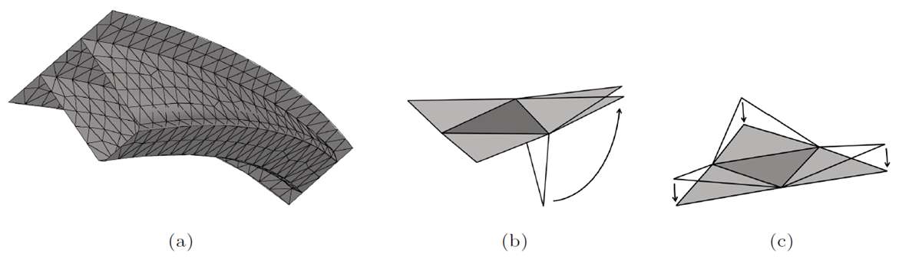

# RTMsim
RTMsim is a new software tool for RTM mould filling simulations.
```@raw html
<br>
```

## Introduction 
Resin Transfer Moulding (RTM) is a manufacturing process for producing thin-walled fiber reinforced polymer composites where dry fibers are placed inside a mould and resin is injected under pressure into the fibrous preform. During mould design, filling simulations can study different manufacturing concepts (i.e. placement of inlet ports and vents) to guarantee complete filling of the part and avoid air entrapment where flow fronts converge. 

In the past, numerous models have been implemented in different software packages to perform filling simulations for RTM. The used simulation packages can be divided into three groups: 
- General purpose CFD software packages, such as [ANSYS Fluent](https://www.ansys.com/products/fluids/ansys-fluent) or the various OpenFOAM distributions, for example from [OpenCFD](https://www.openfoam.com/) or [The OpenFOAM Foundation](https://openfoam.org/)
- Commercially available software packages which are tailored for the simulation of the RTM process, such as [PAM-RTM](https://www.esi.com.au/software/pamrtm/), [RTM-Worx](https://www.polyworx.com/) or [LIMS](https://sites.udel.edu/lims/)
- Easy-to-use simulation tools such as [myRTM](https://www.myrtm.ch/)

All packages describe the flow on a macroscopic level. The first group models the flow through the porous cavity using volume-averaged Navier-Stokes equations. The second group makes use of some assumptions and at first solves a Laplace equation for the pressure inside the region which is already filled and in a second step calculates the flow velocity field to propagate the flow front. It has been shown that the first and second group render very similar results. myRTM from the third group is easy-to-use and can predict the filling pattern properly but neither predict the filling time correctly nor consider non-isotropic preform permeability. Solving conservation laws for fluid flow as in the first group requires a volume mesh of the cavity and consequently the solution is more time-consuming. The second and third group can be solved on a shell mesh where the thickness of the cavity is a property of the cell (similar to porosity and permeability) and slip boundary conditions at the top and bottom walls of the cavity are assumed. 

Based on the analysis of existing software tools for RTM filling simulations the following functional requirements for a new software tool were derived:
- The simulation model shall give correct results for filling pattern and filling time.
- The simulation tool takes only composite-manufacturing related inputs and the simulation shall be robust independent of numerics-related input.
- The simulation tool takes a shell model of the geometry as input and the location-dependent properties are assigned directly on the shell elements.
- New functionalities can be implemented by either adding equations of the same type or modifying existing equations.

RTMsim is a new software tool for RTM filling simulations which fulfills these requirements: Several test cases were used for successfully validating the implemented model. The porous cavity is fully described by a mesh file with triangular cells on the part’s mid-surface and cell set definitions. The latter can be used for specifying the location of the pressure injection ports and regions with different preforms by assigning different thickness, porosity and permeability values. Additional equations (e.g. for modeling the degree-of-cure) can either be added with equations of the same type or modifications of existing equations (e.g. for variable cavity thickness as needed for vacuum assisted resin infusion simulations). 


## Physical model and implementation
Flow through a porous medium is described by a compressible continuity equation, an adiabatic equation of state and a momentum equation with dynamic viscosity of the resin in the Darcy term. In addition, a volume-of-fluid equation is solved to track the flow front but the calculated fluid fraction is not used to calculate a mean density:
```@raw html
<br>
```

The physical quantities in the governing equations are functions of space x and time t:
```@raw html
<br>
```

It is assumed that no cross-thickness flow takes place. Consequently, the fluid domain can be meshed with only one cell through the thickness or with a shell mesh on the mid-surface, see (a) and (b). The red inlet and optional outlet ports are also part of the mesh, see (c). 
```@raw html
<br>
```

In general, flow through curved cavity with junctions must be solved, see (a). The discretized versions of the continuum, momentum and volume-of-fluid equations are solved on the flattened geometry. The neighbouring cells are rotated about the common edge to lie in a plane, see (b) and (c).
```@raw html
<br>
```

Since the flow is described on the mid-surface, the velocity vector has only two non-zero components u and v described in a local coordinate system. The local coordinate system is the result of a projection of a reference vector. The reference vector is chosen such that the local x- and y-directions correspond with the first and second principal permeability directions. 

The four conservation laws for mass density, velocity components u and v in the local cell coordinate system and the fluid fraction describe the flow in the locally flattened geometry, see (a). A coordinate transformation for the velocity components must be performed for every neighbouring cell, see (b).
```@raw html
<br>
```

Discretization of the governing equations on an unstructured mesh follows the ideas presented [here](https://www.amazon.de/Introduction-Computational-Fluid-Dynamics-Finite/dp/0131274988/ref=sr_1_1?__mk_de_DE=%C3%85M%C3%85%C5%BD%C3%95%C3%91&crid=3NA2USVBFJNBS&keywords=An+Introduction+to+Computational+Fluid+Dynamics%3A+The+Finite+Volume+Method&qid=1676620845&sprefix=an+introduction+to+computational+fluid+dynamics+the+finite+volume+method%2Caps%2C79&sr=8-1). For every cell, the numerical flux functions and source terms are evaluated in the flattended geometry and advanced in time.


```@meta
EditURL = "https://github.com/obertscheiderfhwn/RTMsim/blob/main/docs/src/index.md"
```