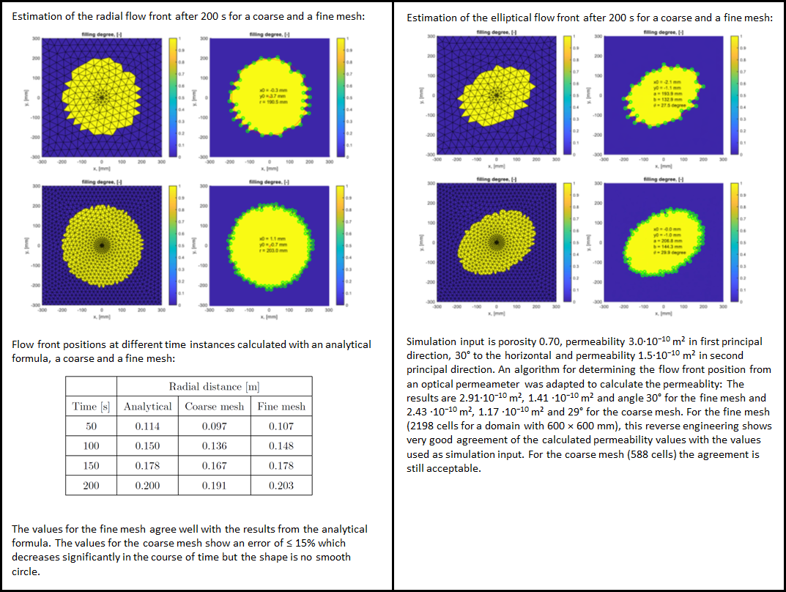
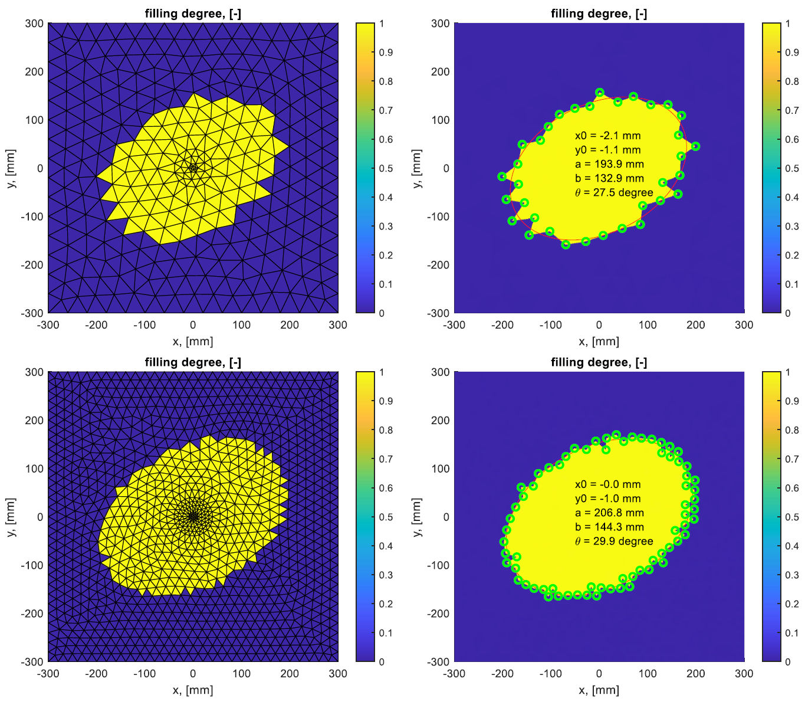

# Summary
Resin Transfer Moulding (RTM) is a manufacturing process for producing thin-walled fiber reinforced polymer composites where dry fibers are placed inside a mould and resin is injected under pressure into the fibrous preform. RTMsim is a robust, easy-to-use and simple-to-extend software tool, written in Julia, for RTM filling simulations. A shell mesh, injection pressure, resin viscosity and the parameters describing the preform are required input. The software was validated with results from literature as well as experiments and compared with results from well-established RTM filling simulation tools.

# Statement of need
Resin Transfer Moulding (RTM) is a manufacturing process for producing thin-walled fiber reinforced polymer composites where dry fibers are placed inside a mould and resin is injected under pressure into the fibrous preform. During mould design, filling simulations can study different manufacturing concepts (i.e. placement of inlet ports and vents) to guarantee complete filling of the part and avoid air entrapment where flow fronts converge. 

In the past, numerous models have been implemented in different software packages to perform filling simulations for RTM. The used simulation packages can be divided into three groups: 
- General purpose CFD software packages, such as ANSYS Fluent or OpenFOAM
- Commercially available software packages which are tailored for the simulation of the RTM process, such as PAM-RTM, RTM-Worx or LIMS
- Easy-to-use simulation tools such as myRTM

All packages describe the flow on a macroscopic level. The first group models the flow through the porous cavity using volume-averaged Navier-Stokes equations `@groessing`. The second group makes use of some assumptions and solves in a first step a Laplace equation for the pressure inside the region which is already filled and in a second step calculates the flow velocity field to propagate the flow front. It has been shown that the first and second group render very similar results. myRTM from the third group is easy-to-use and can predict the filling pattern properly but neither predict the filling time correctly nor consider orthotropic preform permeability. Solving conservation laws for fluid flow as in the first group requires a volume mesh of the cavity and consequently the solution is more time-consuming. The second and third group can be solved on a shell mesh where the thickness of the cavity is a property of the cell (similar to porosity and permeability) and slip boundary conditions at the top and bottom walls of the cavity are assumed. 

Based on the analysis of the existing software tools for RTM filling simulations the following functional requirements for a new software tool were derived:
- The simulation model shall give correct results for filling pattern and filling time.
- The simulation tool takes only composite-manufacturing related inputs and the simulation shall be robust independent of numerics-related input.
- The simulation tool takes a shell model of the geometry as input and the location-dependent properties are assigned directly on the shell elements.
- New functionalities can be implemented by either adding equations of the same type or modifying existing equations.

RTMsim ia a new software tool for RTM filling simulations which fulfills these requirements: Several test cases were used for successfully validating the implemented model. The simulation shall run robustly and independent of numericsrelated input. The porous cavity is fully described by a mesh file with triangular cells on the part’s mid-surface and cell set definitions (for specifying the location of the pressure injection ports and regions with different preforms by assigning different thickness, porosity and permeability values). Additional equations (e.g. for modeling the degree-of-cure) can either be added with equations of the same type or modifications of existing equations (e.g. for variable cavity thickness as needed for vacuum assisted resin infusion simulations). 

# Mathematics

From a flow physics point of view the filling process is described by an incompressible resin which is injected under pressure into a cavity which initially is either evacuated or filled with air. Since the simulation tool shall run robust and independent of numerics-related input like under-relaxation coefficients or time-steps, a one phase compressible model is chosen. Conservation laws for a compressible continuity equation, momentum equations in a local cell coordinate system, an adiabatic law as equation of state and a volume-of-fluid equation to track the resin flow front must be solved. The local cell coordinate system is used to describe the flow in the coordinate system of the orthotropic in-plane permeability (permeability k_1 in first principal direction and permeability k_2=alpha*k_1 in second principal direction). All partial differential equations can be solved using the same method. Other conservation laws, e.g. temperature or degree-of-cure equations to include non-constant resin viscosity, can be added with a similar method. Modifications of the existing conservation laws, e.g. introducing a thickness-dependent permeability which is needed for modeling vacuum-assisted resin infusion (VARI), can be implemented by changing the existing discretized equations.

In order to numerically solve the flow model the computational domain (time and space) is discretized. The temporal domain (i.e. the simulation time) is split into a finite number of time steps where values for the physical quantities on the spatial domain are calculated in a time-marching manner. The spatial domain (i.e. the flow volume) is split into wedge-type cells. Since the walls are assumed to be slip boundaries only one cell is used through the thickness and the cells are bounded by three control surfaces only. Therefore, the spatial domain is defined on the part’s mid-surface and the local thickness of the flow volume is a property of the cell. The mid-surface model can be curved and cells can have edges where more than two cells are connected to each other such as for handling T-junctions. The mid-surface model is divided into a finite number of triangular control areas. The control areas cover the spatial domain completely without overlapping. The cell-centered method where the nodes are placed at the centroid of the control volume is used. 

Since a shell mesh is used in the simulation tool, the conservation laws must be solved on a shell mesh using a generalization of the so-called finite area method. The governing equations are discretized for every cell of the shell mesh. For the evaluation of the numerical flux functions and the pressure gradient, the neighbouring triangular cells are rotated about the common edge to lie in the plane of the considered cell. 

# Validation and verification

Five different test cases are available, successfully validating the Julia implementation of the RTM filling model:
1. Validation of the software for radial flow with isotropic in-plane peremablity: The simulated flow front position after 200 s is compared with the calculated flow front postion from literature.  
2. Verification of the software for radial flow with tilted orthotropic in-plane permeablity: The simulated tilted elliptical flow front is analysed and the calculated orthotropic permeablity is compared with the input (K, alpha, theta).
3. Comparison of the simulated flow front position for a complex annulus filler-like part with the simulated flow front position with Ansys Fluent and comparison of the simulated filling pattern with results from a myRTM simulation.
4. Validation with experimental data from a radial permeameter experiment with two patches with different in-plane permeability and porosity levels. This comparison and guidelines for performing reliable filling simulations (e.g. mesh refinement) will be discussed in a follow-up paper.

The following pictures show the validation results for cases 1, 2 and 3.

The input files for the four validation cases are `input_case1_coarsemesh.txt`, `input_case1_finemesh.txt`, `input_case2_coarsemesh.txt`, `input_case2_finemesh.txt`, `input_case3_coarsemesh.txt`, `input_case3_finemesh.txt, input_case4.txt`.

